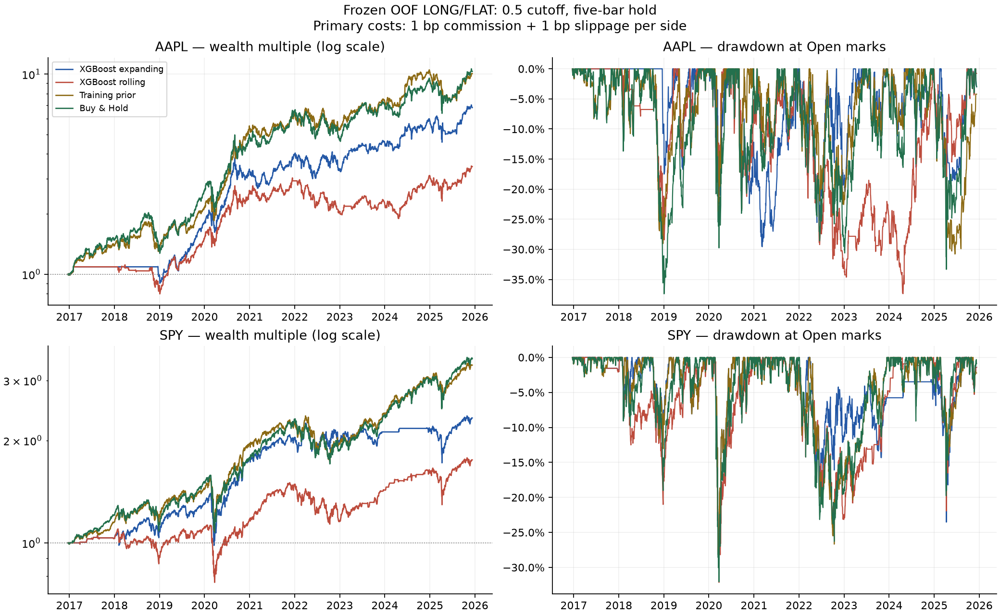

# Stage 5 research report

All results below use frozen Stage 4 probabilities. No model was fitted, no probability was changed, and no threshold was selected from backtest results. The primary cutoff remains .5 and holding period five sessions.

**XGBoost made money before and after modest execution costs, but it underperformed matched Buy & Hold and the training-prior policy on both return and Sharpe in all four asset/mode runs. Positive long exposure in a rising market is not evidence of economic value from the learned signal.**

## Fixed protocol

64 predeclared runs: AAPL/SPY × expanding/rolling × XGBoost/logistic/momentum/training-prior × four cost assumptions. This is a complete sensitivity comparison, not a search for a winning strategy. Starting capital 100,000; size 100%; fractional adjusted units; no leverage, shorts, cash interest, or threshold sweep.

Event: log(Close[t+5]/Close[t]) > .002. LONG if probability >= .5, otherwise FLAT. Entry Open[t+1], exit Open[t+6]. Signals during an active position are ignored; the exit-day close may generate the next entry for the following open. Open-to-open holding intervals do not overlap.

All strategies and benchmarks use 2016-12-21 through 2025-12-10 (2,254 session intervals). Buy & Hold buys and liquidates at those endpoints, with the same costs. Cash earns zero. All required exits were supported; zero incomplete LONG trades were excluded in these actual runs.

The saved daily timestamps are provider candle labels, not 05:00 UTC execution times. Execution means the actual exchange open of that labeled session. The full snapshot is used to preserve actual trading-day adjacency through OOF gaps.

## Primary results

| Source | Model | Gross return | Net return | CAGR | Sharpe | Sortino | Max drawdown | Exposure | Trades |
| --- | --- | --- | --- | --- | --- | --- | --- | --- | --- |
| AAPL_expanding | xgboost | 663.33% | 580.27% | 23.83% | 0.978 | 1.462 | -29.56% | 63.89% | 288 |
| AAPL_expanding | logistic | 12.01% | 7.06% | 0.76% | 0.124 | 0.174 | -23.54% | 25.07% | 113 |
| AAPL_expanding | momentum | 278.82% | 232.11% | 14.32% | 0.665 | 0.955 | -36.38% | 72.98% | 329 |
| AAPL_expanding | training_prior | 1068.53% | 905.76% | 29.35% | 1.089 | 1.620 | -30.78% | 83.19% | 375 |
| AAPL_rolling | xgboost | 287.14% | 244.74% | 14.80% | 0.678 | 0.985 | -37.37% | 64.33% | 290 |
| AAPL_rolling | logistic | 66.09% | 57.99% | 5.23% | 0.394 | 0.580 | -28.01% | 27.73% | 125 |
| AAPL_rolling | momentum | 278.82% | 232.11% | 14.32% | 0.665 | 0.955 | -36.38% | 72.98% | 329 |
| AAPL_rolling | training_prior | 1068.53% | 905.76% | 29.35% | 1.089 | 1.620 | -30.78% | 83.19% | 375 |
| SPY_expanding | xgboost | 161.82% | 132.67% | 9.87% | 0.683 | 0.956 | -29.65% | 65.44% | 295 |
| SPY_expanding | logistic | 13.56% | 4.66% | 0.51% | 0.103 | 0.134 | -38.59% | 45.25% | 204 |
| SPY_expanding | momentum | 148.39% | 117.68% | 9.06% | 0.664 | 0.915 | -30.40% | 73.20% | 330 |
| SPY_expanding | training_prior | 286.45% | 232.62% | 14.34% | 0.912 | 1.287 | -29.65% | 83.19% | 375 |
| SPY_rolling | xgboost | 97.70% | 75.28% | 6.46% | 0.473 | 0.642 | -32.14% | 66.77% | 301 |
| SPY_rolling | logistic | 49.98% | 40.34% | 3.85% | 0.381 | 0.523 | -24.94% | 36.82% | 166 |
| SPY_rolling | momentum | 148.39% | 117.68% | 9.06% | 0.664 | 0.915 | -30.40% | 73.20% | 330 |
| SPY_rolling | training_prior | 286.45% | 232.62% | 14.34% | 0.912 | 1.287 | -29.65% | 83.19% | 375 |

Gross means a separate zero-cost replay. Primary net costs are 1 bp commission plus 1 bp adverse slippage per side; this is a modest reference assumption, not an empirically measured fill model.

## Matched Buy & Hold and cash

| Source | XGB return | Buy & Hold return | Excess return (pp) | XGB Sharpe | B&H Sharpe | XGB drawdown | B&H drawdown |
| --- | --- | --- | --- | --- | --- | --- | --- |
| AAPL_expanding | 580.27% | 931.32% | -351.05 | 0.978 | 1.024 | -29.56% | -37.39% |
| AAPL_rolling | 244.74% | 931.32% | -686.58 | 0.678 | 1.024 | -37.37% | -37.39% |
| SPY_expanding | 132.67% | 247.30% | -114.63 | 0.683 | 0.874 | -29.65% | -32.05% |
| SPY_rolling | 75.28% | 247.30% | -172.03 | 0.473 | 0.874 | -32.14% | -32.05% |

Cash return and drawdown are zero. Its Sharpe and Sortino are undefined, rather than fabricated zero risk-adjusted performance. AAPL expanding XGBoost reduced drawdown, but still did not improve Sharpe/Sortino over Buy & Hold. SPY rolling slightly worsened maximum drawdown.

## Cost sensitivity — every predeclared scenario

Costs below are per side: zero=(0 commission, 0 slippage); primary=(1,1); higher-slippage=(1,5); stress=(5,10), all in basis points. No scenario is selected as the expected result.

| Source | Model | Zero return | Primary return | Higher-slippage return | Stress return |
| --- | --- | --- | --- | --- | --- |
| AAPL_expanding | xgboost | 663.33% | 580.27% | 440.28% | 221.72% |
| AAPL_expanding | logistic | 12.01% | 7.06% | -2.20% | -20.20% |
| AAPL_expanding | momentum | 278.82% | 232.11% | 155.25% | 41.18% |
| AAPL_expanding | training_prior | 1068.53% | 905.76% | 645.09% | 279.37% |
| AAPL_rolling | xgboost | 287.14% | 244.74% | 173.36% | 62.19% |
| AAPL_rolling | logistic | 66.09% | 57.99% | 42.96% | 14.15% |
| AAPL_rolling | momentum | 278.82% | 232.11% | 155.25% | 41.18% |
| AAPL_rolling | training_prior | 1068.53% | 905.76% | 645.09% | 279.37% |
| SPY_expanding | xgboost | 161.82% | 132.67% | 83.76% | 8.06% |
| SPY_expanding | logistic | 13.56% | 4.66% | -11.10% | -38.42% |
| SPY_expanding | momentum | 148.39% | 117.68% | 67.17% | -7.70% |
| SPY_expanding | training_prior | 286.45% | 232.62% | 146.41% | 25.46% |
| SPY_rolling | xgboost | 97.70% | 75.28% | 37.77% | -19.86% |
| SPY_rolling | logistic | 49.98% | 40.34% | 22.89% | -8.85% |
| SPY_rolling | momentum | 148.39% | 117.68% | 67.17% | -7.70% |
| SPY_rolling | training_prior | 286.45% | 232.62% | 146.41% | 25.46% |

## Costs, trade frequency and accounting

| Source | Model | Win rate | Profit factor | Avg win ($) | Avg loss ($) | Expectancy ($) | Entries/year | Bars between entries | Turnover × initial capital | Costs ($) | Approx break-even bps/side |
| --- | --- | --- | --- | --- | --- | --- | --- | --- | --- | --- | --- |
| AAPL_expanding | xgboost | 60.76% | 1.457 | 10576.794 | -11244.880 | 2014.818 | 32.110 | 7.836 | 2048.535 | 40970.703 | 30.145 |
| AAPL_expanding | logistic | 54.87% | 1.042 | 2816.190 | -3285.207 | 62.462 | 12.599 | 19.679 | 240.608 | 4812.151 | 4.877 |
| AAPL_expanding | momentum | 57.14% | 1.258 | 6019.642 | -6380.052 | 705.487 | 36.681 | 6.851 | 1399.761 | 27995.212 | 18.388 |
| AAPL_expanding | training_prior | 60.27% | 1.404 | 13939.382 | -15064.006 | 2415.370 | 41.810 | 6.000 | 3549.537 | 70990.723 | 27.224 |
| AAPL_rolling | xgboost | 57.59% | 1.292 | 6484.487 | -6814.401 | 843.924 | 32.333 | 7.768 | 1249.652 | 24993.032 | 21.496 |
| AAPL_rolling | logistic | 60.80% | 1.410 | 2623.294 | -2885.242 | 463.948 | 13.937 | 17.210 | 254.814 | 5096.275 | 25.256 |
| AAPL_rolling | momentum | 57.14% | 1.258 | 6019.642 | -6380.052 | 705.487 | 36.681 | 6.851 | 1399.761 | 27995.212 | 18.388 |
| AAPL_rolling | training_prior | 60.27% | 1.404 | 13939.382 | -15064.006 | 2415.370 | 41.810 | 6.000 | 3549.537 | 70990.723 | 27.224 |
| SPY_expanding | xgboost | 63.05% | 1.358 | 2706.581 | -3401.368 | 449.746 | 32.890 | 7.432 | 994.099 | 19881.980 | 15.214 |
| SPY_expanding | logistic | 58.33% | 1.030 | 1352.177 | -1838.165 | 22.868 | 22.745 | 10.768 | 393.212 | 7864.240 | 3.310 |
| SPY_expanding | momentum | 62.42% | 1.347 | 2219.703 | -2738.553 | 356.600 | 36.793 | 6.830 | 983.930 | 19678.607 | 13.985 |
| SPY_expanding | training_prior | 63.73% | 1.468 | 3051.814 | -3652.652 | 620.328 | 41.810 | 6.000 | 1436.363 | 28727.256 | 18.226 |
| SPY_rolling | xgboost | 62.13% | 1.253 | 1994.368 | -2611.142 | 250.089 | 33.559 | 7.283 | 747.325 | 14946.496 | 12.235 |
| SPY_rolling | logistic | 62.05% | 1.242 | 2008.442 | -2643.265 | 243.035 | 18.508 | 10.855 | 417.243 | 8344.863 | 11.575 |
| SPY_rolling | momentum | 62.42% | 1.347 | 2219.703 | -2738.553 | 356.600 | 36.793 | 6.830 | 983.930 | 19678.607 | 13.985 |
| SPY_rolling | training_prior | 63.73% | 1.468 | 3051.814 | -3652.652 | 620.328 | 41.810 | 6.000 | 1436.363 | 28727.256 | 18.226 |

Every strategy trade holds five bar intervals. Turnover sums raw entry and exit notionals divided by initial capital, not average current equity; it is cumulative over almost nine years. Positive/negative trade PnL, win/loss rates, profit factor and expectancy are after costs. Quantity sizing includes entry commission inside the cash allocation.

The separate gross replay compounds different quantities. Its final wealth minus net wealth therefore includes lost compounding and is not identical to cash commissions plus slippage. Within the net ledger, gross PnL uses actual quantities and reconciles exactly with net PnL plus costs.

Estimated cost break-even is only a first-order dollar-PnL/two-sided-notional approximation on zero-cost quantities. It ignores cost-dependent sizing/compounding and asks when profit approaches zero, not when the strategy beats Buy & Hold. It must not be treated as a precise tolerable cost or tuned parameter.

## Risk statistics

| Source | Model | Annual volatility | Sharpe | Sortino | Calmar | Max drawdown | Capital exposure |
| --- | --- | --- | --- | --- | --- | --- | --- |
| AAPL_expanding | xgboost | 25.14% | 0.978 | 1.462 | 0.806 | -29.56% | 63.89% |
| AAPL_expanding | logistic | 12.87% | 0.124 | 0.174 | 0.032 | -23.54% | 25.07% |
| AAPL_expanding | momentum | 24.82% | 0.665 | 0.955 | 0.394 | -36.38% | 72.98% |
| AAPL_expanding | training_prior | 27.06% | 1.089 | 1.620 | 0.953 | -30.78% | 83.19% |
| AAPL_rolling | xgboost | 25.04% | 0.678 | 0.985 | 0.396 | -37.37% | 64.33% |
| AAPL_rolling | logistic | 16.38% | 0.394 | 0.580 | 0.187 | -28.01% | 27.73% |
| AAPL_rolling | momentum | 24.82% | 0.665 | 0.955 | 0.394 | -36.38% | 72.98% |
| AAPL_rolling | training_prior | 27.06% | 1.089 | 1.620 | 0.953 | -30.78% | 83.19% |
| SPY_expanding | xgboost | 15.62% | 0.683 | 0.956 | 0.333 | -29.65% | 65.44% |
| SPY_expanding | logistic | 11.94% | 0.103 | 0.134 | 0.013 | -38.59% | 45.25% |
| SPY_expanding | momentum | 14.76% | 0.664 | 0.915 | 0.298 | -30.40% | 73.20% |
| SPY_expanding | training_prior | 16.17% | 0.912 | 1.287 | 0.484 | -29.65% | 83.19% |
| SPY_rolling | xgboost | 16.01% | 0.473 | 0.642 | 0.201 | -32.14% | 66.77% |
| SPY_rolling | logistic | 11.77% | 0.381 | 0.523 | 0.154 | -24.94% | 36.82% |
| SPY_rolling | momentum | 14.76% | 0.664 | 0.915 | 0.298 | -30.40% | 73.20% |
| SPY_rolling | training_prior | 16.17% | 0.912 | 1.287 | 0.484 | -29.65% | 83.19% |

Equity marks are after orders at each Open. The first return interval starts from pre-entry capital so initial slippage/fees are included. Drawdown peaks include initial capital. Sharpe uses session returns, sample standard deviation, sqrt(252), and zero risk-free rate. Sortino uses RMS negative session returns across all sessions (minimum acceptable return zero). CAGR uses elapsed calendar days / 365.25. Intraday and close-only drawdown extremes are not represented.

## Probability buckets — outcomes, not trade returns

All 2,250 OOF observations per source are included, including those ignored by the non-overlap policy. Fixed buckets are left-inclusive, except that the last bucket also includes 1. No calibration was fitted. Adjacent five-bar target outcomes are dependent; these counts are not independent trials.

### AAPL_expanding xgboost

| Probability bucket | Count | Mean predicted probability | Actual event frequency | Mean future log return | Mean future simple return |
| --- | --- | --- | --- | --- | --- |
| [0.00, 0.40) | 12 | 36.15% | 50.00% | 0.54% | 0.57% |
| [0.40, 0.45) | 33 | 43.43% | 63.64% | 1.11% | 1.18% |
| [0.45, 0.50) | 575 | 48.80% | 56.52% | 0.27% | 0.34% |
| [0.50, 0.55) | 1160 | 52.75% | 57.67% | 0.70% | 0.78% |
| [0.55, 0.60) | 452 | 56.04% | 53.10% | 0.35% | 0.44% |
| [0.60, 1.00] | 18 | 63.47% | 50.00% | 0.31% | 0.42% |

### AAPL_expanding logistic

| Probability bucket | Count | Mean predicted probability | Actual event frequency | Mean future log return | Mean future simple return |
| --- | --- | --- | --- | --- | --- |
| [0.00, 0.40) | 1486 | 15.68% | 57.81% | 0.61% | 0.69% |
| [0.40, 0.45) | 114 | 42.78% | 57.89% | 0.37% | 0.46% |
| [0.45, 0.50) | 140 | 47.65% | 52.14% | 0.70% | 0.76% |
| [0.50, 0.55) | 138 | 52.39% | 50.72% | 0.02% | 0.10% |
| [0.55, 0.60) | 113 | 57.45% | 58.41% | 0.84% | 0.92% |
| [0.60, 1.00] | 259 | 68.04% | 52.51% | 0.12% | 0.17% |

### AAPL_rolling xgboost

| Probability bucket | Count | Mean predicted probability | Actual event frequency | Mean future log return | Mean future simple return |
| --- | --- | --- | --- | --- | --- |
| [0.00, 0.40) | 30 | 37.61% | 53.33% | 0.38% | 0.43% |
| [0.40, 0.45) | 77 | 42.79% | 54.55% | 0.33% | 0.41% |
| [0.45, 0.50) | 520 | 48.99% | 55.77% | 0.20% | 0.26% |
| [0.50, 0.55) | 836 | 53.15% | 53.83% | 0.45% | 0.55% |
| [0.55, 0.60) | 677 | 56.46% | 61.15% | 0.95% | 1.02% |
| [0.60, 1.00] | 110 | 63.40% | 52.73% | 0.08% | 0.16% |

### AAPL_rolling logistic

| Probability bucket | Count | Mean predicted probability | Actual event frequency | Mean future log return | Mean future simple return |
| --- | --- | --- | --- | --- | --- |
| [0.00, 0.40) | 1447 | 14.43% | 57.77% | 0.59% | 0.68% |
| [0.40, 0.45) | 119 | 42.80% | 45.38% | -0.06% | -0.00% |
| [0.45, 0.50) | 100 | 47.73% | 54.00% | 0.49% | 0.57% |
| [0.50, 0.55) | 95 | 52.33% | 63.16% | 0.85% | 0.93% |
| [0.55, 0.60) | 79 | 57.27% | 59.49% | 0.94% | 0.99% |
| [0.60, 1.00] | 410 | 73.61% | 53.41% | 0.28% | 0.36% |

### SPY_expanding xgboost

| Probability bucket | Count | Mean predicted probability | Actual event frequency | Mean future log return | Mean future simple return |
| --- | --- | --- | --- | --- | --- |
| [0.00, 0.40) | 206 | 37.25% | 59.22% | 0.43% | 0.44% |
| [0.40, 0.45) | 232 | 42.98% | 55.17% | 0.33% | 0.34% |
| [0.45, 0.50) | 109 | 46.98% | 68.81% | 0.65% | 0.66% |
| [0.50, 0.55) | 84 | 53.10% | 53.57% | 0.37% | 0.39% |
| [0.55, 0.60) | 1163 | 56.92% | 59.59% | 0.34% | 0.37% |
| [0.60, 1.00] | 456 | 67.17% | 51.10% | -0.08% | -0.04% |

### SPY_expanding logistic

| Probability bucket | Count | Mean predicted probability | Actual event frequency | Mean future log return | Mean future simple return |
| --- | --- | --- | --- | --- | --- |
| [0.00, 0.40) | 933 | 22.14% | 59.06% | 0.46% | 0.49% |
| [0.40, 0.45) | 177 | 42.51% | 59.32% | 0.16% | 0.18% |
| [0.45, 0.50) | 201 | 47.45% | 53.73% | 0.03% | 0.07% |
| [0.50, 0.55) | 229 | 52.50% | 64.19% | 0.53% | 0.55% |
| [0.55, 0.60) | 228 | 57.43% | 58.77% | 0.28% | 0.30% |
| [0.60, 1.00] | 482 | 68.23% | 52.07% | -0.05% | -0.02% |

### SPY_rolling xgboost

| Probability bucket | Count | Mean predicted probability | Actual event frequency | Mean future log return | Mean future simple return |
| --- | --- | --- | --- | --- | --- |
| [0.00, 0.40) | 5 | 37.81% | 40.00% | -0.44% | -0.43% |
| [0.40, 0.45) | 187 | 43.37% | 52.94% | 0.27% | 0.28% |
| [0.45, 0.50) | 348 | 47.24% | 60.34% | 0.41% | 0.42% |
| [0.50, 0.55) | 723 | 53.45% | 59.89% | 0.23% | 0.26% |
| [0.55, 0.60) | 452 | 57.33% | 55.31% | 0.20% | 0.25% |
| [0.60, 1.00] | 535 | 64.09% | 56.45% | 0.33% | 0.36% |

### SPY_rolling logistic

| Probability bucket | Count | Mean predicted probability | Actual event frequency | Mean future log return | Mean future simple return |
| --- | --- | --- | --- | --- | --- |
| [0.00, 0.40) | 1220 | 17.86% | 59.10% | 0.39% | 0.42% |
| [0.40, 0.45) | 111 | 42.69% | 54.05% | -0.03% | -0.00% |
| [0.45, 0.50) | 92 | 47.60% | 60.87% | 0.32% | 0.34% |
| [0.50, 0.55) | 74 | 52.41% | 52.70% | 0.13% | 0.15% |
| [0.55, 0.60) | 78 | 57.39% | 42.31% | -0.57% | -0.51% |
| [0.60, 1.00] | 675 | 76.83% | 57.33% | 0.23% | 0.27% |

Higher probabilities did not consistently correspond to better outcomes. AAPL expanding XGBoost event rates were 57.7%, 53.1%, and 50.0% in the .50–.55, .55–.60 and .60+ buckets. The last had only 18 observations. AAPL rolling improved in .55–.60 but fell back in .60+. SPY expanding .60+ averaged predicted probability 67.2%, yet event frequency was 51.1% and mean future simple return was negative. This is not monotonic evidence of useful probability ordering.

## Interpretation

Expanding XGBoost performed better economically than rolling on both assets here, despite slightly weaker Stage 4 AUC summaries. This is descriptive: no mode is selected or retuned after these results. Four-mode profits and often smaller drawdowns do not establish incremental ML value, because Buy & Hold and the simpler training-prior policy earned more with higher Sharpe.

The training-prior probability stayed above .5 throughout these folds, so its strategy was simply a five-sessions-invested, one-session-flat schedule. It carried no observation-specific prediction advantage. Its stronger results make it especially important not to attribute XGBoost gains to learned economic edge.

Logistic produced small positive primary returns but weak Sharpe and severe benchmark underperformance. Several logistic variants became negative under higher costs. Smaller exposure alone is not a demonstrated forecasting benefit. XGBoost also had substantial cost drag, and SPY rolling became negative under the stress scenario.

## Source integrity and limitations

The loader checks original manifests, fingerprints, required files, OOF/market/target timestamps, ticker/interval, and fold availability. Stage 5 outputs link original manifest hashes and configuration fingerprints. Execution receives probabilities and Open prices; future targets are isolated in diagnostic reporting. No Stage 4 files or model states are overwritten.

Consistent adjusted OHLC is inferred from the inspected Yahoo retrieval path and yfinance auto_adjust=True default. Stage 4 lacks explicit adjustment flags and the yfinance version, so this convention is recorded as inferred rather than vendor-attested. Adjusted fractional units avoid mixing raw Open with adjusted Close; dividends are not credited again. This remains a research return proxy, not a historical broker dividend, tax or share-count ledger.

No market impact, open-auction liquidity constraints, integer-share rounding, tax, cash yield, stops, borrowing, or broker integration is modeled. Finite positive snapshot prices do not guarantee real fills. The small two-asset historical sample, overlapping target outcomes and retrospective data adjustments limit inference. Backtest performance does not guarantee future performance.

## Artifact index

Comparison manifest: [stage5_comparison_640b3940.json](../artifacts/stage5_comparison_640b3940.json). Each primary row below links its human-readable report; all 64 runs and all output paths appear in the comparison manifest.

| Source | Model | Primary report |
| --- | --- | --- |
| AAPL_expanding | xgboost | [20260910T084244_ab5cece8](../artifacts/AAPL/1d/h5/walk_forward/20260910T081655_ca5887a2/backtest/20260910T084244_ab5cece8/report.md) |
| AAPL_expanding | logistic | [20260910T084245_7a247768](../artifacts/AAPL/1d/h5/walk_forward/20260910T081655_ca5887a2/backtest/20260910T084245_7a247768/report.md) |
| AAPL_expanding | momentum | [20260910T084246_08963ad4](../artifacts/AAPL/1d/h5/walk_forward/20260910T081655_ca5887a2/backtest/20260910T084246_08963ad4/report.md) |
| AAPL_expanding | training_prior | [20260910T084247_66cefd9f](../artifacts/AAPL/1d/h5/walk_forward/20260910T081655_ca5887a2/backtest/20260910T084247_66cefd9f/report.md) |
| AAPL_rolling | xgboost | [20260910T084248_ecc495f1](../artifacts/AAPL/1d/h5/walk_forward/20260910T081657_5ad10c5f/backtest/20260910T084248_ecc495f1/report.md) |
| AAPL_rolling | logistic | [20260910T084250_5d02864f](../artifacts/AAPL/1d/h5/walk_forward/20260910T081657_5ad10c5f/backtest/20260910T084250_5d02864f/report.md) |
| AAPL_rolling | momentum | [20260910T084251_6d0286f7](../artifacts/AAPL/1d/h5/walk_forward/20260910T081657_5ad10c5f/backtest/20260910T084251_6d0286f7/report.md) |
| AAPL_rolling | training_prior | [20260910T084252_e318fd9c](../artifacts/AAPL/1d/h5/walk_forward/20260910T081657_5ad10c5f/backtest/20260910T084252_e318fd9c/report.md) |
| SPY_expanding | xgboost | [20260910T084253_940c9f99](../artifacts/SPY/1d/h5/walk_forward/20260910T081700_fdf71a33/backtest/20260910T084253_940c9f99/report.md) |
| SPY_expanding | logistic | [20260910T084254_e9ebee75](../artifacts/SPY/1d/h5/walk_forward/20260910T081700_fdf71a33/backtest/20260910T084254_e9ebee75/report.md) |
| SPY_expanding | momentum | [20260910T084256_d2eeb85f](../artifacts/SPY/1d/h5/walk_forward/20260910T081700_fdf71a33/backtest/20260910T084256_d2eeb85f/report.md) |
| SPY_expanding | training_prior | [20260910T084257_3dd77782](../artifacts/SPY/1d/h5/walk_forward/20260910T081700_fdf71a33/backtest/20260910T084257_3dd77782/report.md) |
| SPY_rolling | xgboost | [20260910T084258_47d19811](../artifacts/SPY/1d/h5/walk_forward/20260910T081702_8490f3d6/backtest/20260910T084258_47d19811/report.md) |
| SPY_rolling | logistic | [20260910T084259_77de9242](../artifacts/SPY/1d/h5/walk_forward/20260910T081702_8490f3d6/backtest/20260910T084259_77de9242/report.md) |
| SPY_rolling | momentum | [20260910T084301_a36bbe84](../artifacts/SPY/1d/h5/walk_forward/20260910T081702_8490f3d6/backtest/20260910T084301_a36bbe84/report.md) |
| SPY_rolling | training_prior | [20260910T084302_1e0e0be9](../artifacts/SPY/1d/h5/walk_forward/20260910T081702_8490f3d6/backtest/20260910T084302_1e0e0be9/report.md) |

Each run saves configuration, machine-readable summary, trades, equity, separate gross replay, matching Buy & Hold/cash curves, probability buckets, and a checksum manifest. Raw execution prices in trades mean the frozen adjusted snapshot values before simulated slippage, not historically unadjusted exchange prices.

## Next stage

Stage 5 is complete as an execution/accounting framework. There is no robust evidence of incremental economic value from the current ML signal. Stage 6 may introduce a GRU only as another research candidate to evaluate against unchanged simple baselines under the same temporal and execution framework. No PyTorch implementation has begun.

## Executed verification

Verified in the project `.venv311` environment on 2026-09-10:

- `python -m pytest -q -rs`: **199 passed, 1 skipped**. The unchanged Keras integration test skips because Keras is unavailable in this environment. All previous 162 tests remain passing; Stage 5 adds 37 cases.
- `python -m compileall -q stock_app tests scripts`: passed.
- `git diff --check`: passed.
- Stage 5 CLI help and the full 64-run research CLI protocol: executed successfully.
- Every Stage 5 configuration fingerprint and output checksum passed verification. All four original Stage 4 manifests remained valid and unchanged.
- All saved trades used the exact frozen probability and snapshot Open, entered one bar after their signal, exited five bars after entry, and had no overlapping positions. Cash/position/equity reconciliation, compounded periodic returns, trade PnL, two-sided costs and matching benchmark dates passed for all 64 runs.
- The generated wealth/drawdown figure was visually inspected against the saved curves.

Tests include independently calculated fill costs, next-bar timing, known targets lacking an extra exit Open, chronological gaps, non-overlap, no short mapping, zero/no-loss cases, Sharpe/Sortino/drawdown/profit factor, planted causal profitable signals, independent random probabilities, future-outcome isolation, and explicit rejection of model fitting during a backtest. No Stage 6 work was started.
